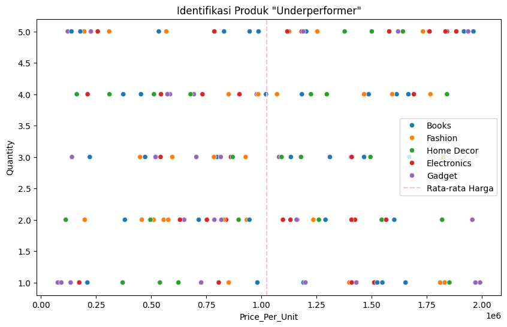

# Laporan Praktikum: Analisis Performa Penjualan E-commerce

## 1. Business Question
Analisis ini bertujuan untuk menjawab beberapa pertanyaan kunci bisnis berikut:
* **Tren Penjualan:** Bagaimana fluktuasi total penjualan dalam rentang waktu bulanan?
* **Korelasi Pemasaran:** Apakah anggaran iklan (`Ad_Budget`) memiliki korelasi kuat terhadap total penjualan?
* **Identifikasi Produk:** Produk mana yang termasuk kategori *underperformer* (harga tinggi namun volume penjualan rendah)?
* **Segmentasi Pelanggan:** Siapa pelanggan yang masuk dalam segmen prioritas untuk program loyalitas (RFM)?
* **Efisiensi Kategori:** Seberapa efisien alokasi anggaran iklan pada setiap kategori produk?

## 2. Data Wrangling
Proses pembersihan dan persiapan data dilakukan untuk memastikan akurasi analisis:
* **Pembersihan Data:** Menghapus baris dengan harga unit (`Price_Per_Unit`) yang tidak valid atau di bawah 0.
* **Konversi Tipe Data:** Mengubah kolom `Order_Date` menjadi format *datetime* agar bisa diproses secara temporal.
* **Feature Engineering:** Membuat kolom baru `Month` untuk analisis tren bulanan.

## 3. Insights & Visualizations

### A. Tren Penjualan Bulanan
Visualisasi menggunakan *Line Chart* menunjukkan fluktuasi pendapatan dari waktu ke waktu untuk mengidentifikasi pola pertumbuhan bulanan perusahaan.

### B. Analisis Korelasi (Heatmap)
Berdasarkan *Heatmap*, kita melihat hubungan antara `Total_Sales`, `Ad_Budget`, dan variabel lainnya untuk mengukur efektivitas biaya iklan.

### C. Produk "Underperformer"
Melalui *Scatter Plot*, ditemukan produk yang memiliki harga di atas rata-rata namun volume kuantitas rendah, yang berpotensi membebani arus kas.

### D. Segmentasi Pelanggan (RFM Analysis)
Pelanggan dikelompokkan berdasarkan *Recency*, *Frequency*, dan *Monetary* untuk menentukan strategi pemasaran yang lebih terarah.

## 4. Uji Hipotesis Sederhana
Dilakukan pengujian pengaruh iklan dengan membagi data menjadi dua kelompok berdasarkan nilai median anggaran iklan:
* **Iklan Tinggi vs Iklan Rendah:** Membandingkan rata-rata penjualan dari kedua kelompok tersebut.
* **Hasil:** Analisis menunjukkan apakah peningkatan `Ad_Budget` benar-benar menghasilkan peningkatan `Total_Sales` yang signifikan.

## 5. Recommendation
1. **Strategi Harga:** Melakukan evaluasi harga atau memberikan promo pada produk *underperformer* agar stok lebih cepat laku.
2. **Re-alokasi Budget:** Mengalihkan anggaran iklan ke kategori produk yang memiliki rasio efisiensi lebih tinggi.
3. **Loyalty Program:** Memprioritaskan segmen pelanggan dengan skor RFM tinggi untuk menjaga retensi pelanggan.

---
*Laporan ini disusun sebagai bagian dari tugas Praktikum Analisis dan Visualisasi Data.*
